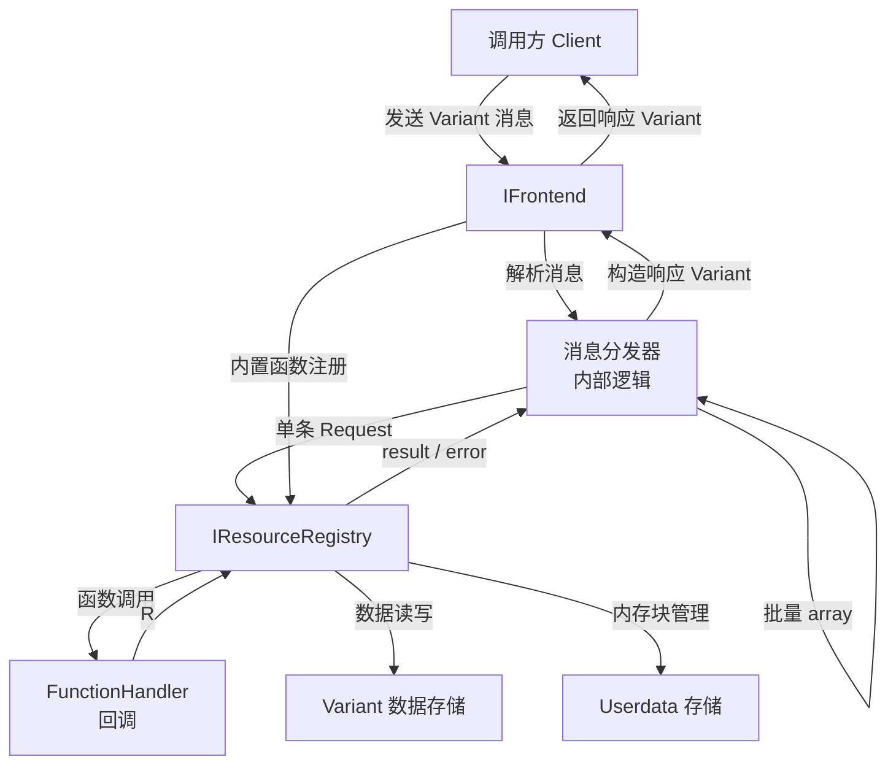

# Frontend 模块架构规划

## 概述

Frontend 模块为 LunaSDK 提供基于流的消息传递 API，支持远程过程调用（RPC）、模型上下文协议（MCP）以及 GUI 应用中的命令式用户操作（支持撤销/重做）。

其核心思想是将函数调用、事件和结果跨越不同域（进程、主机、编程语言边界）进行传递，采用类 JSON-RPC 2.0 格式的消息协议，消息体以 `Variant` 对象表示。

---

## 目录结构

```
Modules/Luna/Frontend/
├── Frontend.hpp          // 模块公开头文件（对外 API 入口，含消息辅助函数）
├── Resource.hpp          // 资源注册表接口
├── IFrontend.hpp         // IFrontend 主接口
├── xmake.lua             // 构建脚本
└── Source/
    ├── Frontend.cpp      // 模块注册与初始化
    ├── FrontendImpl.cpp  // IFrontend 实现
    └── ResourceRegistry.cpp // 资源注册表实现
```

---

## 核心对象与接口

### 1. 消息层（Message Layer）

消息直接以 `Variant`（object 类型）表示，**无独立的 `Message` 结构体或 `MessageType` 枚举**。接收端通过检查字段存在性自动识别消息类型：
- 含有 `method` 字段 → 请求消息（Request）
- 含有 `result` 或 `error` 字段 → 响应消息（Response）
- `id` 为 `null` 或缺失 → 通知消息（Notification，无响应）

#### 消息字段约定

| 字段 | 类型 | 说明 |
|------|------|------|
| `method` | `string` | 【请求】要调用的函数 URL |
| `params` | `array` / `object` / `null` | 【请求】函数参数 |
| `id` | `integer` / `string` / `null` | 请求/响应共用；`null` 表示 Notification |
| `result` | `Variant`（非 null） | 【响应-成功】函数返回值 |
| `error` | `object` | 【响应-失败】错误对象 |

#### 消息辅助函数

声明于 `Frontend.hpp`，方便构造符合规范的消息 `Variant`：

```cpp
// 构造请求消息
Variant make_request(const Name& method, Variant params, Variant id);

// 构造通知消息（id 为 null，不产生响应）
Variant make_notification(const Name& method, Variant params);

// 构造成功响应
Variant make_response(Variant id, Variant result);

// 构造错误响应
Variant make_error_response(Variant id, Variant error);

// 构造符合规范的 error object
Variant make_frontend_error(
    const Name& category,
    const Name& code,
    const Name& message = {},  // 可选
    Variant     data    = {}   // 可选
);
```

---

### 2. 资源注册表（Resource Registry）

#### `ResourceType` 枚举

```cpp
enum class ResourceType : u8
{
    null     = 0,  // 资源不存在
    function = 1,  // 可调用函数
    data     = 2,  // Variant 数据
    userdata = 3,  // 不透明内存块
};
```

#### `FunctionHandler` 函数类型

服务端注册函数时提供的回调签名：

```cpp
// params  : 请求消息中的 params 字段
// returns : 成功时返回 result Variant；失败时返回 ErrCode（由 IFrontend 转换为 error 对象）
using FunctionHandler = Function<R<Variant>(const Variant& params)>;
```

#### `IResourceRegistry` 接口

管理所有资源的注册、查询与删除。

```cpp
struct IResourceRegistry : virtual Interface
{
    luiid("{...}");

    // 设置一个函数资源（overwrite=false 时若已存在则返回错误）
    virtual RV set_function(const Path& url, FunctionHandler handler, bool overwrite = false) = 0;

    // 设置一个 Variant 数据资源（兼具注册与修改功能，overwrite=false 时若已存在则返回错误）
    virtual RV set_data(const Path& url, Variant data, bool overwrite = false) = 0;

    // 设置一个 Userdata 资源（附带析构回调，overwrite=false 时若已存在则返回错误）
    virtual RV set_userdata(
        const Path& url,
        void*       data,
        usize       size,
        void (*destructor)(void*) = nullptr,
        bool        overwrite    = false
    ) = 0;

    // 查询资源类型
    virtual ResourceType get_resource_type(const Path& url) = 0;

    // 获取 Variant 数据资源
    virtual R<Variant> get_data(const Path& url) = 0;

    // 删除资源
    virtual RV remove_resource(const Path& url) = 0;

    // 调用函数资源（由 IFrontend 内部使用）
    virtual R<Variant> invoke(const Path& url, const Variant& params) = 0;
};
```

---

### 3. 主接口 `IFrontend`

`IFrontend` 是 Frontend 模块对外暴露的核心接口，负责：
- 持有并管理 `IResourceRegistry`；
- 处理传入消息（单条或批量）；
- 构造并返回响应消息；
- 内置标准资源函数（`get_type`、`get`、`set`、`delete`）。

```cpp
struct IFrontend : virtual Interface
{
    luiid("{...}");

    // 获取此 Frontend 实例关联的资源注册表
    virtual IResourceRegistry* get_registry() = 0;

    // 处理一条传入消息（Variant object 或 array）
    // 返回响应消息（Variant object 或 array），Notification 不产生响应（返回 null Variant）
    virtual Variant handle_message(const Variant& message) = 0;
};
```

---

### 4. 内置资源函数（Built-in Resource Functions）

Frontend 在初始化时向自身的 `IResourceRegistry` 注册以下内置函数，
URL 前缀为 `/__builtin__/`：

| URL | 功能 |
|-----|------|
| `/__builtin__/get_type` | 返回指定 URL 的资源类型字符串 |
| `/__builtin__/get`      | 返回指定 URL 的 Variant 数据 |
| `/__builtin__/set`      | 设置指定 URL 的 Variant 数据 |
| `/__builtin__/delete`   | 删除指定 URL 的资源 |

---

### 5. 模块入口（Frontend Module）

遵循 LunaSDK `Module` 体系：

```cpp
// Frontend.hpp
LUNA_FRONTEND_API IFrontend* get_frontend();     // 获取全局默认 Frontend 实例
LUNA_FRONTEND_API Ref<IFrontend> new_frontend(); // 创建一个新的独立 Frontend 实例

LUNA_FRONTEND_API Module* get_frontend_module(); // 返回模块指针，用于 add_module()
```

`FrontendModule` 实现 `Module` 接口：
- `on_register()`：声明对 `Runtime` 模块的依赖；
- `on_init()`：创建全局默认 `IFrontend` 实例，注册内置资源函数；
- `on_close()`：销毁全局实例。

---

## 对象协作图



---

## 消息处理流程

```mermaid
graph TD
    A[收到 Variant 消息] --> B{是 array?}
    B -- 是 --> C[拆分为多条消息逐个处理]
    B -- 否 --> D{含 method 字段?}
    C --> D
    D -- 是 --> E[解析 method / params / id]
    D -- 否 --> P[含 result/error 字段，交由调用方回调处理]
    E --> F[在 IResourceRegistry 中查找 method URL]
    F --> G{资源存在且为 function?}
    G -- 否 --> H[构造 error 响应: method_not_found]
    G -- 是 --> I[调用 FunctionHandler(params)]
    I --> J{调用成功?}
    J -- 是 --> K[构造 result 响应]
    J -- 否 --> L[构造 error 响应]
    K --> M{id 为 null (Notification)?}
    L --> M
    H --> M
    M -- 是 --> N[丢弃响应]
    M -- 否 --> O[将响应加入返回列表]
    O --> Q[返回响应 Variant (单条或 array)]
```

---

## 依赖关系

| 依赖模块 | 用途 |
|---------|------|
| `Runtime` | `Variant`、`Path`、`Name`、`Error`、`Interface`、`Module`、`Function`、`HashMap` 等基础类型 |

Frontend 模块本身**不依赖**任何图形、音频、网络模块，保持轻量和可移植。

---

## 关键设计决策

1. **消息体全部用 `Variant` 表示，无独立消息结构体**：消息直接以 `Variant` object 承载，接收端根据字段存在性自动判断消息类型（含 `method` 为请求，含 `result`/`error` 为响应），无需额外枚举或结构体。与 LunaSDK 现有序列化体系无缝集成，可直接序列化为 JSON/BSON，也可在进程内零拷贝传递。

2. **URL 使用 `Path` 类型**：复用 Runtime 中已有的路径解析和层级管理能力，资源组织方式与文件系统类似，便于层级命名和批量管理。

3. **`IResourceRegistry` 与 `IFrontend` 分离**：注册表专注于资源的 CRUD，Frontend 专注于消息协议的解析与分发，职责清晰，也便于单独测试。

4. **仅提供同步接口**：`IFrontend` 只暴露 `handle_message` 同步接口，异步场景由用户在外部建立消息队列，在合适的时机调用同步接口处理，实现方式与具体业务解耦，`IFrontend` 自身保持简单纯粹。

5. **Notification 支持**：`id` 为 `null` 的请求消息为通知（Notification），处理后不产生任何响应消息，节省往返开销。

6. **内置函数统一管理**：内置函数（`get_type`、`get`、`set`、`delete`）注册于保留路径 `/__builtin__/`，与用户自定义函数完全隔离，避免命名冲突。
